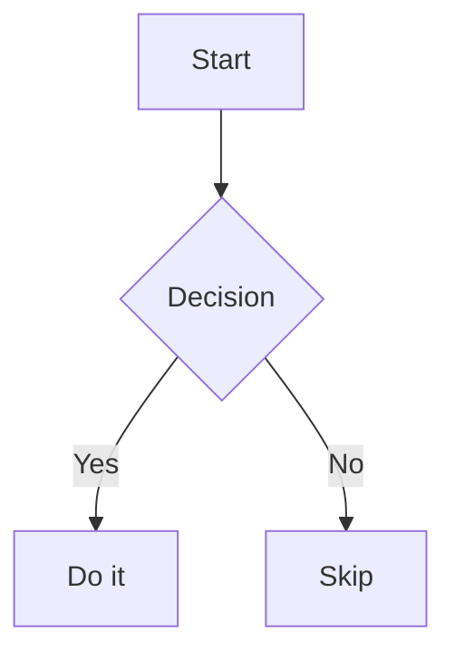

# Cards

A clean, card-based Hugo theme with multi-language support, dark mode, and customizable colors.


## Features

- **Card-based layout** — clean, modern design with card-style content blocks
- **Multi-language** — 7 languages: English, 简体中文, 繁體中文, Français, Deutsch, Русский, Bahasa Indonesia
- **Dark mode** — auto (follows system), light, or dark mode with smooth transitions
- **Customizable colors** — full light/dark color palette configurable in `hugo.toml`
- **KaTeX** — mathematical formula rendering with auto-render
- **Mermaid** — diagram and chart rendering from code blocks
- **PhotoSwipe** — touch-friendly image lightbox with zoom and swipe gestures
- **Search** — Fuse.js powered client-side search with real-time results
- **Comments** — supports Giscus, Disqus, Utterances, Gitalk, Waline, and Twikoo
- **Analytics** — Google Analytics, Vercel Analytics, and Baidu Tongji
- **SEO** — Open Graph, Twitter Cards, JSON-LD structured data, sitemap
- **Table of contents** — auto-generated, collapsible sidebar TOC with smooth scroll
- **Reading progress** — optional progress bar at page top
- **Reading time** — estimated reading time and word count
- **Share buttons** — copy link, QQ, WeChat sharing
- **Related articles** — configurable related content suggestions
- **Article navigation** — previous/next post links with article count
- **Immersive reading** — distraction-free reading mode toggle
- **RSS** — automatic RSS feed generation
- **Responsive** — fully responsive design across desktop, tablet, and mobile
- **Accessible** — semantic HTML, ARIA labels, keyboard navigation

## Installation

### Using Git

```bash
cd your-hugo-site
git submodule add https://github.com/Cnkrru/hugo-theme-cards.git themes/cards
```

### Using Hugo Modules

```bash
cd your-hugo-site
hugo mod init github.com/your-username/your-site
```

Then add to `hugo.toml`:

```toml
[module]
  [[module.imports]]
    path = "github.com/Cnkrru/hugo-theme-cards"
```

Then run `hugo mod get` to download.

### Manual Download

Download the [latest release](https://github.com/Cnkrru/hugo-theme-cards/releases) and extract it to `themes/cards/`.

## Setup

Set the theme in your site's `hugo.toml`:

```toml
theme = 'cards'
```

See [exampleSite/hugo.toml](https://github.com/Cnkrru/hugo-theme-cards/blob/main/exampleSite/hugo.toml) for a complete configuration example.

## Configuration

### Site Basics

```toml
baseURL = 'https://example.com'
languageCode = 'zh-cn'
defaultContentLanguage = 'zh-cn'
title = 'My Blog'
theme = 'cards'

[params]
  author = 'Your Name'
  description = 'A blog built with Hugo Cards theme'
  mainSections = ['posts']
```

### Menus

Configure sidebar navigation with i18n-friendly names:

```toml
[menus]
  [[menus.sidebar_links]]
    name = 'home'
    url = '/'
    weight = 1
  [[menus.sidebar_links]]
    name = 'about'
    url = '/about/'
    weight = 2
  [[menus.sidebar_links]]
    name = 'archives'
    url = '/archives/'
    weight = 3
  [[menus.sidebar_links]]
    name = 'tags'
    url = '/tags/'
    weight = 4
  [[menus.sidebar_links]]
    name = 'links'
    url = '/links/'
    weight = 5
```

### Colors

Full light and dark color palette customization:

```toml
[params.colors]
  [params.colors.light]
    color1 = 'rgba(255, 192, 203, 1)'
    color2 = 'white'
    bg = 'white'
    text = '#333'
    content = 'white'
    hover = 'rgba(255, 192, 203, 1)'
    shadow = 'rgba(0, 0, 0, 0.1)'
    cursor = 'rgba(255, 192, 203, 1)'
    gradient = 'linear-gradient(90deg, #45b7d1, #4ecd8d, #feb47b, #4ecd8d, #45b7d1)'

  [params.colors.dark]
    color1 = '#3aaae7'
    color2 = '#1a237e'
    bg = '#15073c'
    text = 'white'
    hover = '#3aaae7'
    content = '#333'
    shadow = 'rgba(0, 0, 0, 0.3)'
    cursor = '#3aaae7'
    gradient = 'linear-gradient(90deg, #cc45d1, #654ecd, #7b97fe, #654ecd, #cc45d1)'
```

### Color Scheme

```toml
[params.colorScheme]
  default = 'auto'  # auto, light, dark
```

### Header

```toml
[params.header]
  [params.header.readingProgress]
    enabled = true

  [params.header.logo]
    enabled = true
    text = 'My Blog'
    font = 'Arial'
```

### Sidebar

```toml
[params.sidebar]
  compact = false

  [params.sidebar.avatar]
    enabled = true
    src = '/images/avator.jpg'

  [params.sidebar.welcome]
    enabled = true
    subtitle = 'Welcome to my blog'

  [params.sidebar.links]
    enabled = true
    links = []
```

### Article Settings

```toml
[params.article]
  readingTime = true
  math = true

  [params.article.page]
    showToc = true
    showReadingTime = true
    showWordCount = true
    showRelatedArticles = true
    showComments = true
    showShare = true

  [params.article.toc]
    enabled = true
    collapsed = false
    maxDepth = 3

  [params.article.related]
    enabled = true
    title = 'Related Articles'

  [params.article.license]
    enabled = true
    default = 'CC BY-NC-SA 4.0'

  [params.article.listCard]
    showCategory = true
    showTags = true
    showDate = true

  [params.article.pageNav]
    showPrevNext = true
    showArticleCount = true
```

### Comments

Six comment providers are supported:

```toml
[params.comments]
  enabled = true
  provider = 'giscus'  # giscus, disqus, utterances, gitalk, waline, twikoo
  title = 'Comments'

  # Giscus
  [params.comments.giscus]
    repo = 'your-github/repo'
    repoId = 'your-repo-id'
    category = 'Announcements'
    categoryId = 'your-category-id'
    mapping = 'pathname'

  # Waline
  [params.comments.waline]
    serverURL = 'https://your-waline-server.com'

  # Twikoo
  [params.comments.twikoo]
    envId = 'your-env-id'

  # Disqus
  [params.comments.disqus]
    shortname = 'your-shortname'

  # Utterances
  [params.comments.utterances]
    repo = 'your-github/repo'

  # Gitalk
  [params.comments.gitalk]
    clientID = 'your-client-id'
    clientSecret = 'your-client-secret'
    repo = 'your-github/repo'
    owner = 'your-github-username'
    admin = ['your-github-username']
```

### Search

```toml
[params.search]
  enable = true
  mode = 'fuse'

  [params.search.results]
    showCategory = true
    showTags = true
    maxResults = 20

  [params.search.input]
    placeholder = 'Search'
    width = '400px'
    minWidth = '120px'
```

### Analytics

```toml
[params.analytics]
  enabled = true
  provider = 'google'  # google, vercel, baidu

  [params.analytics.google]
    trackingID = 'G-XXXXXXXXXX'

  [params.analytics.baidu]
    trackingID = 'your-baidu-id'
```

### Image Processing

```toml
[params.imageProcessing]
  content = true  # enable responsive images, lazy loading
```

### Footer

```toml
[params.footer]
  since = '2024-01-01T00:00:00'
  showWebsiteAge = true
  customText = 'Built with Hugo'

  [params.footer.copyright]
    enabled = true
    text = '© {{ now.Year }} {{ site.Title }}'
```

### Mobile

```toml
[params.mobile]
  [params.mobile.sidebarWidgets]
    enabled = true
    widgets = ['avatar', 'welcome', 'links']
```

### SEO

```toml
[params.seo]
  enabled = true
  description = 'My Blog'
  author = 'Your Name'
  logo = '/logo.png'

  [params.seo.twitter]
    site = '@your-twitter'
    card = 'summary'
```

## Content

### Front Matter

Posts support standard Hugo front matter with these key fields:

```toml
+++
title = 'My Post'
date = '2024-01-01T00:00:00+08:00'
draft = false
tags = ['tag1', 'tag2']
categories = ['category1']
+++
```

### KaTeX

Enable math rendering in site config (`math = true`), then use `$...$` for inline and `$$...$$` for block formulas:

```markdown
Inline: $E = mc^2$

Block:
$$
\int_{a}^{b} f(x) \, dx = F(b) - F(a)
$$
```

### Mermaid

Use fenced code blocks with `mermaid` language identifier:

````markdown

````

### Images

Images are automatically enhanced with:
- Lazy loading and low-quality placeholder color
- Responsive `srcset` generation
- PhotoSwipe lightbox (click to view full-size)

```markdown

```

## Supported Languages

| Language | Code |
|----------|------|
| English | `en` |
| 简体中文 | `zh-cn` |
| 繁體中文 | `zh-tw` |
| Français | `fr` |
| Deutsch | `de` |
| Русский | `ru` |
| Bahasa Indonesia | `id` |

## License

This theme is released under the [MIT License](https://github.com/Cnkrru/hugo-theme-cards/blob/main/LICENSE).
