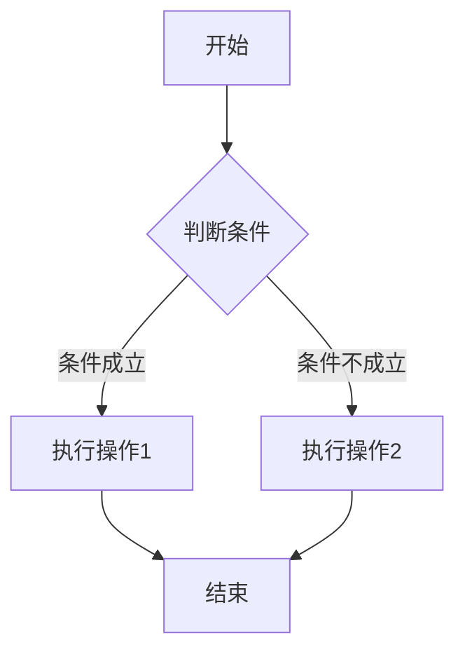
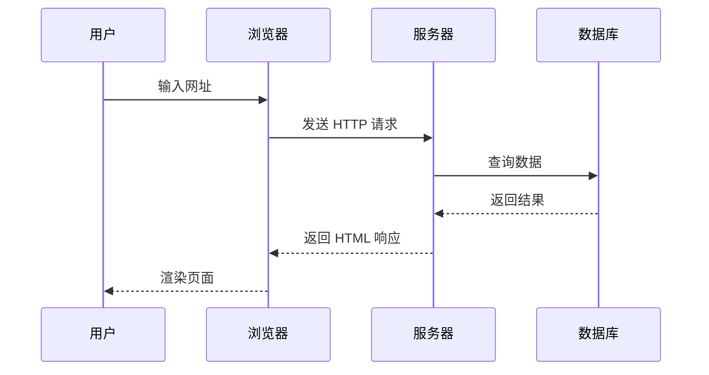
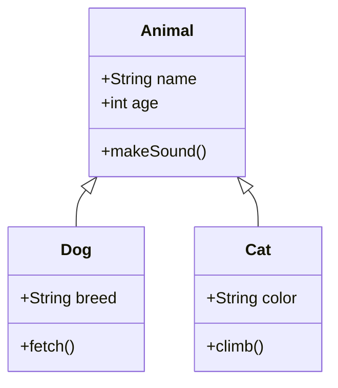
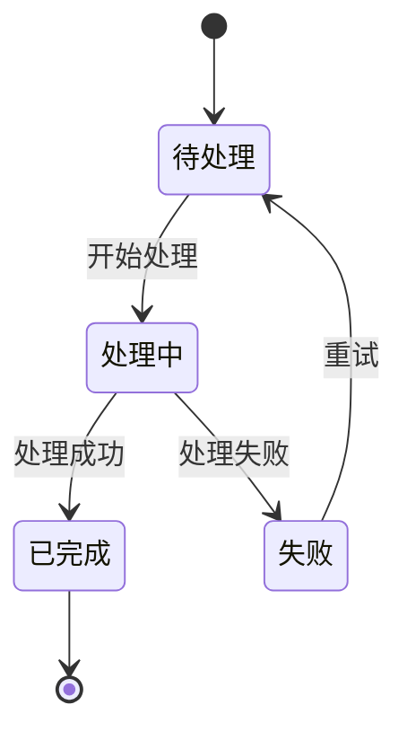
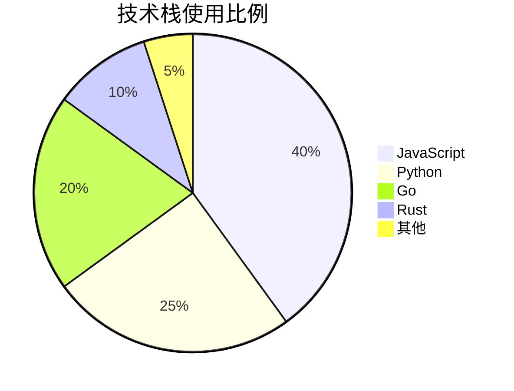
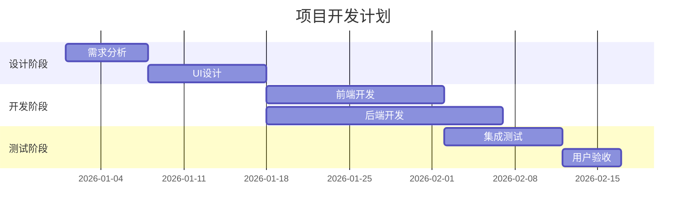

+++
title = 'Mermaid 图表展示'
date = '2026-05-05T12:00:00+08:00'
draft = false
tags = ['mermaid', 'diagram']
categories = ['演示']
mermaid = true
type = 'posts'
+++

本文展示主题对 Mermaid 图表的支持，可以直接在 Markdown 中绘制各种图表。

## 流程图

## 时序图

## 类图

## 状态图

## 饼图

## 甘特图

